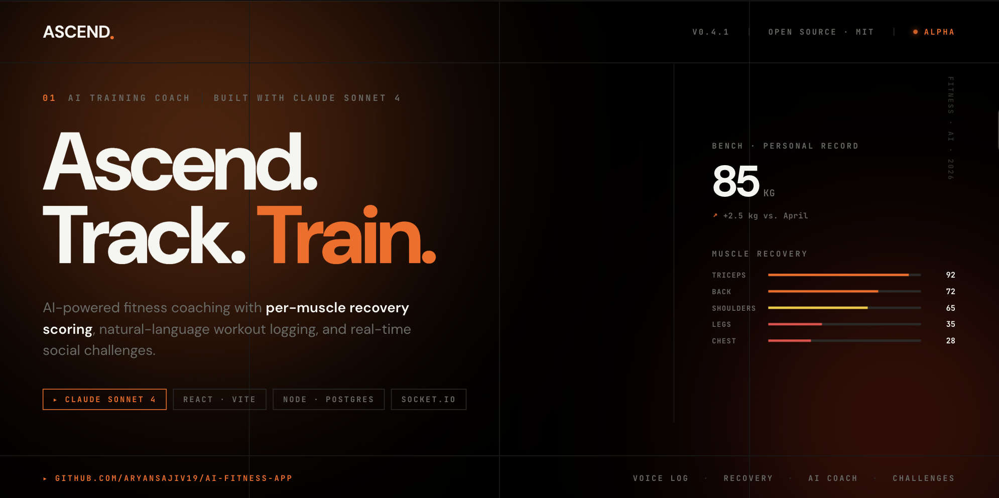

# ASCEND

**AI-powered fitness coaching with per-muscle recovery scoring, voice logging, and real-time social challenges**




---

## Features

- Per-muscle-group recovery scoring — calculated live from training volume and recency across a 7-day window
- AI training coach powered by Claude Sonnet 4 with full access to workout history and recovery data
- Voice-powered workout logging — describe a session in plain English, Claude parses it into structured data
- Full-text workout search using PostgreSQL `tsvector` ranked retrieval with ILIKE fallback
- Real-time social challenges and leaderboards via socket.io WebSockets
- JWT authentication with bcrypt password hashing
- Containerized deployment with Docker and docker-compose

---

## Tech Stack

**Backend**
- Node.js 20, Express 5
- PostgreSQL 16 + pgvector extension
- socket.io 4

**Frontend**
- React 18, Vite 6
- CSS custom properties (no framework)
- DM Sans + JetBrains Mono (Google Fonts)

**AI**
- Anthropic Claude Sonnet 4 — coaching chat (streaming SSE) and voice NLP parsing

**Auth**
- JSON Web Tokens (JWT), bcrypt

**Deployment**
- Docker, docker-compose

---

## Architecture

```
┌─────────────────────────────────┐
│         React 18 + Vite         │  :5000 (dev)
│  Auth · Dashboard · Logger      │
│  Chat · Challenges · Progress   │
└────────────┬────────────────────┘
             │ HTTP + WebSocket
             ▼
┌─────────────────────────────────┐
│       Express 5 + socket.io     │  :3000
│                                 │
│  /api/auth      JWT + bcrypt    │
│  /api/workouts  CRUD + search   │
│  /api/chat      SSE streaming   │──▶ Anthropic Claude Sonnet 4
│  /api/recovery  fatigue model   │
│  /api/challenges  + leaderboard │
└────────────┬────────────────────┘
             │ pg Pool
             ▼
┌─────────────────────────────────┐
│  PostgreSQL 16 + pgvector       │
│  users · workouts · challenges  │
│  challenge_participants         │
└─────────────────────────────────┘
```

---

## Getting Started

### Prerequisites

- Node.js 20+
- PostgreSQL 16+ with the pgvector extension (`CREATE EXTENSION vector`)
- An [Anthropic API key](https://console.anthropic.com/)
- Docker (optional, for containerized setup)

### Environment Variables

Copy `.env.example` and fill in your values:

```bash
cp .env.example .env
```

| Variable | Description |
|----------|-------------|
| `DATABASE_URL` | PostgreSQL connection string |
| `JWT_SECRET` | Secret used to sign JWTs |
| `ANTHROPIC_API_KEY` | Anthropic API key for Claude |

### Local Setup

```bash
# 1. Clone the repo
git clone https://github.com/aryansajiv19/ai-fitness-app
cd ai-fitness-app

# 2. Install backend dependencies
npm install

# 3. Install frontend dependencies
cd frontend && npm install && cd ..

# 4. Copy and fill in environment variables
cp .env.example .env

# 5. Bootstrap the database schema (idempotent — safe to re-run)
node setup.js

# 6. Start the backend on port 3000
node server.js

# 7. In a separate terminal — start the frontend on port 5000
cd frontend && npm run dev
```

Open [http://localhost:5000](http://localhost:5000). The Vite dev server proxies `/api` and `/socket.io` to the backend automatically.

### Docker Setup

```bash
docker-compose up --build
```

Starts three services:

| Service | Image | Port |
|---------|-------|------|
| `db` | `pgvector/pgvector:pg16` | 5432 |
| `app` | Node.js 20 Alpine | 3000 |
| `frontend` | Nginx (multi-stage Vite build) | 80 |

---

## API Reference

### Auth

| Method | Path | Auth | Description |
|--------|------|------|-------------|
| POST | `/api/auth/signup` | — | Create account |
| POST | `/api/auth/login` | — | Login, returns JWT |

### Workouts

| Method | Path | Auth | Description |
|--------|------|------|-------------|
| GET | `/api/workouts` | JWT | List user's workouts |
| POST | `/api/workouts` | JWT | Log a workout |
| PUT | `/api/workouts/:id` | JWT | Edit a workout |
| DELETE | `/api/workouts/:id` | JWT | Delete a workout |
| GET | `/api/workouts/search?q=` | JWT | Full-text search (ILIKE) |
| POST | `/api/workouts/semantic-search` | JWT | tsvector ranked search |
| POST | `/api/workouts/voice` | JWT | NLP parse description → log workout |

### Recovery

| Method | Path | Auth | Description |
|--------|------|------|-------------|
| GET | `/api/recovery` | JWT | Per-muscle recovery scores (0–100) |

### Challenges

| Method | Path | Auth | Description |
|--------|------|------|-------------|
| GET | `/api/challenges` | JWT | List all challenges |
| POST | `/api/challenges` | JWT | Create a challenge |
| POST | `/api/challenges/:id/join` | JWT | Join a challenge |

### Leaderboard

| Method | Path | Auth | Description |
|--------|------|------|-------------|
| GET | `/api/leaderboard/:id` | JWT | Challenge leaderboard |

### AI

| Method | Path | Auth | Description |
|--------|------|------|-------------|
| POST | `/api/chat` | JWT | Streaming AI coaching (SSE) — send `{ message, stream: true }` |

### WebSocket Events

| Event | Direction | Description |
|-------|-----------|-------------|
| `join_challenge` | Client → Server | Subscribe to a challenge room |
| `leave_challenge` | Client → Server | Unsubscribe from a challenge room |
| `leaderboard_update` | Server → Client | Live push when a participant logs a workout |

---

## Project Structure

```
ai-fitness-app/
├── server.js           # Express + socket.io entrypoint
├── auth.js             # Signup / login routes
├── middleware.js       # JWT verification
├── chat.js             # Claude Sonnet 4 streaming SSE
├── voice.js            # NLP workout parsing via Claude
├── embeddings.js       # tsvector semantic search endpoint
├── challenges.js       # Challenge CRUD
├── leaderboard.js      # Leaderboard routes
├── recovery.js         # Muscle recovery calculation
├── db.js               # PostgreSQL pool
├── setup.js            # Idempotent schema bootstrap
├── Dockerfile          # Node.js 20 Alpine backend image
├── docker-compose.yml  # Full stack orchestration
├── .env.example        # Environment variable template
└── frontend/
    ├── Dockerfile      # Multi-stage Vite build → nginx
    ├── nginx.conf      # SPA fallback + API reverse proxy
    └── src/
        ├── pages/      # Auth, Dashboard, WorkoutLogger, ChatPage,
        │               #   Challenges, LeaderboardPage, Progress
        ├── components/ # Layout (sidebar, cursor glow, ambient effects)
        ├── lib/        # api.js — fetch wrapper + SSE stream helper
        └── index.css   # Design system (CSS vars, animations)
```

---

## Roadmap

**Done**
- [x] JWT auth with bcrypt
- [x] Workout CRUD with muscle group tagging
- [x] Per-muscle recovery scoring (7-day fatigue model)
- [x] AI coaching chat with Claude Sonnet 4 (streaming)
- [x] Voice / natural language workout logging via Claude NLP
- [x] Full-text workout search (tsvector + ILIKE fallback)
- [x] Real-time challenges and leaderboard via socket.io
- [x] Progress charts with PR detection
- [x] pgvector extension enabled with ivfflat index
- [x] Docker + docker-compose for full stack deployment

**Planned**
- [ ] Progressive overload detection and plateau alerts
- [ ] Workout plan generation from recovery + history
- [ ] Mobile app (React Native)
- [ ] Structured logging and request tracing

---

## License

MIT — see [LICENSE](./LICENSE)

Built by [Aryan Sajiv](https://github.com/aryansajiv19)
